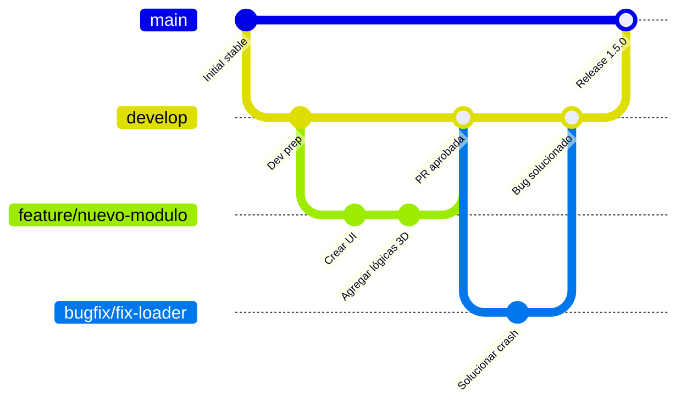

# Manual de Desarrollo y Colaboración

Bienvenido al **Configurador 3D de Líneas de Paletizado Verbruggen** (`sales-configurator`).

Este documento establece las directrices y estándares de desarrollo para que el equipo trabaje de manera coordinada, segura y eficiente. Su cumplimiento es obligatorio para todos los colaboradores (humanos y asistentes de IA).

---

## 1. Arquitectura y Estructura del Proyecto

Este repositorio contiene una **única aplicación frontend (SPA)**, sin backend propio:

- **Frontend (raíz)**: React 19 + TypeScript + Vite. Escena 3D con `@react-three/fiber` y `@react-three/drei`, estado global con Zustand, exportación PDF con jspdf.
- **Base de datos**: Supabase (PostgreSQL con Row Level Security). No hay servidor Express ni MySQL: el cliente habla directamente con Supabase y la autorización se aplica con políticas RLS.
- **Migraciones**: `supabase/migrations/` es la fuente de verdad del esquema; `database/` es una copia documental de referencia.

Para el detalle de carpetas y el flujo de la aplicación, consulta el [README.md](./README.md).

---

## 2. Estrategia de Ramas (Git Flow Simplificado)

Para garantizar la estabilidad y evitar subir cambios rotos a producción, utilizamos un esquema de ramas estructurado:



### Definición de ramas

1. **`master`/`main` (Producción)**: código estable en producción. **Prohibido hacer push directo.**
2. **`develop` (Integración)**: código de desarrollo más reciente. Todos los colaboradores integran aquí sus cambios mediante PR.
3. **`feature/*`**: ramas de corta vida creadas desde `develop` para una tarea específica.
4. **`bugfix/*` / `fix/*`**: correcciones de fallos encontrados en pruebas o desarrollo.
5. **`hotfix/*`**: correcciones críticas creadas desde la rama de producción; se fusionan en producción y en `develop`.

---

## 3. Flujo Diario de Trabajo

### Paso 1: sincronizar con `develop`
```bash
git checkout develop
git pull origin develop
```

### Paso 2: crear la rama de trabajo
Prefijo correspondiente, en minúsculas y separado por guiones:
```bash
git checkout -b feature/mi-nueva-funcionalidad
# o para un error: git checkout -b bugfix/corregir-error-vista
```

### Paso 3: desarrollar y verificar localmente
Antes de cualquier commit, valida el proyecto en local (misma batería que ejecuta la CI):
```bash
npm run lint      # ESLint sin errores
npx tsc -b        # Type-check estricto de TypeScript
npm run test      # Suite de Vitest completa
npm run build     # Build de producción de Vite
```
> [!IMPORTANT]
> Si hay errores de lint, tipos, tests o compilación, **debes resolverlos antes de subir tus cambios**. No se aceptan PRs con la CI en rojo.

### Paso 4: commits con Conventional Commits
```bash
git add .
git commit -m "feat: agregar soporte para rotar módulos en plano 2D"
```

### Paso 5: subir la rama y abrir la Pull Request
```bash
git push -u origin feature/mi-nueva-funcionalidad
```
Abre una **Pull Request hacia `develop`** en GitHub. Al menos un revisor debe aprobar el código, y la CI debe estar en verde, antes de fusionar.

---

## 4. Estándar de Mensajes de Commit (Conventional Commits)

Estructura obligatoria: `<tipo>: <descripción en minúsculas y español>`

| Tipo | Descripción | Ejemplo |
| :--- | :--- | :--- |
| `feat` | Nueva funcionalidad o módulo para el usuario. | `feat: agregar boton de exportar a PDF en menu flotante` |
| `fix` | Corrección de un bug. | `fix: corregir desalineación de snap points al rotar` |
| `refactor` | Cambios en el código que no alteran la funcionalidad. | `refactor: optimizar la carga de modelos 3D pesados` |
| `docs` | Modificaciones en archivos de documentación. | `docs: actualizar DEVELOPMENT.md con reglas de commits` |
| `style` | Cambios de formato, CSS, espacios (sin lógica de código). | `style: cambiar el degradado del panel de control` |
| `chore` | Actualización de dependencias, scripts de build, etc. | `chore: actualizar libreria three.js a ultima version` |
| `test` | Incorporación o arreglo de pruebas unitarias. | `test: agregar test para validaciones de snap` |

---

## 5. Integración Continua (CI)

El workflow **`.github/workflows/ci.yml`** se ejecuta automáticamente en cada push a cualquier rama y en cada PR hacia `master`. Corre, en este orden:

1. `npm ci` — instalación limpia y reproducible.
2. `npm run lint` — ESLint.
3. `npx tsc -b` — type-check de TypeScript.
4. `npm run test` — suite de Vitest (ver [docs/TESTING.md](./docs/TESTING.md)).
5. `npm run build` — build de producción.

Notas:

- El checkout se hace con `lfs: false` para **no descargar los modelos `.glb`** (Git LFS); ni los tests ni el build los necesitan.
- El build usa valores dummy de `VITE_SUPABASE_URL` / `VITE_SUPABASE_ANON_KEY`; el cliente tolera su ausencia con un warning.

### Checklist antes de abrir una PR

- [ ] `npm run lint` sin errores ni warnings nuevos.
- [ ] `npx tsc -b` sin errores de tipos.
- [ ] `npm run test` con toda la suite en verde.
- [ ] `npm run build` compila correctamente.
- [ ] Sin `console.log` de debug ni bloques de código muerto.
- [ ] Sin secretos ni valores reales de `.env` en el diff (ver [SECURITY.md](./SECURITY.md)).
- [ ] Si tocaste el esquema: migración nueva en `supabase/migrations/` y copia documental en `database/` actualizada.

---

## 6. Reglas de Convivencia y Buenas Prácticas

- **Modelos 3D (`.glb`)**: se versionan mediante **Git LFS** (ver `.gitattributes`). Nunca añadas un `.glb` como blob normal de git; verifica que LFS esté instalado (`git lfs install`) antes de commitear modelos nuevos en `public/3d/`.
- **Secretos**: `.env` está en `.gitignore` y nunca se commitea. Cualquier secreto que llegue a un commit se considera comprometido: sigue el procedimiento de [SECURITY.md](./SECURITY.md).
- **No dejes código comentado en producción**: limpia `console.log` de debug y elimina bloques obsoletos.
- **Migraciones**: toda modificación del esquema se hace con una migración nueva en `supabase/migrations/` (nunca editando migraciones ya aplicadas).

---

## 7. Protección de Ramas en Repositorios Privados Gratuitos

> [!NOTE]
> **Limitación de GitHub**: en planes gratuitos, las *Branch Protection Rules* no están disponibles para repositorios **privados** (solo para públicos o planes de pago).

Por ello, la protección depende de la disciplina del equipo, apoyada por la CI:

1. **CI obligatoria**: el workflow de CI corre en cada push y PR; ninguna PR se fusiona con la CI en rojo.
2. **Disciplina de equipo**: ningún colaborador (humano o IA) hace `git push` directo a `master` ni a `develop`. Toda fusión pasa por una Pull Request revisada y validada por el dueño del repositorio.
