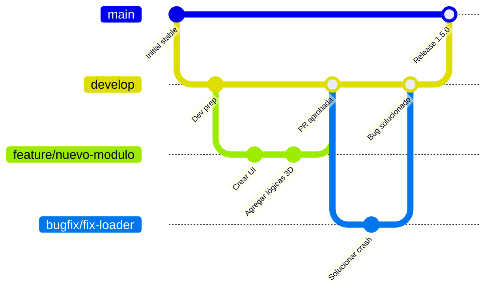

# Manual de Desarrollo y Colaboración

¡Bienvenido al proyecto **Verbruggen Assembly — 3D Machine Builder**! 🚀

Este documento establece las directrices y estándares de desarrollo para que el equipo trabaje de manera coordinada, segura y eficiente. Su cumplimiento es obligatorio para todos los colaboradores (humanos y asistentes de IA).

---

## 📂 1. Arquitectura y Estructura del Proyecto

El repositorio está dividido en dos grandes bloques:
*   **Frontend (Raíz)**: Aplicación React 18, TypeScript y Vite. Contiene la escena 3D en `@react-three/fiber` y la lógica de ensambles.
*   **Backend (`server/`)**: API REST construida en Node.js, Express y TypeScript, que interactúa con una base de datos MySQL.

Para detalles de directorios específicos, consulta el [README.md](file:///c:/Users/camet/Dropbox/5_diseno/Herno/3d_sales/README.md).

---

## 🌿 2. Estrategia de Ramas (Git Flow Simplificado)

Para garantizar la estabilidad y evitar subir cambios rotos al servidor de producción, utilizamos un esquema de ramas estructurado:



### Definición de Ramas:
1.  **`main` (Producción)**: Código estable en producción. **Está prohibido hacer push directo a esta rama.**
2.  **`develop` (Integración)**: Contiene el código de desarrollo más reciente. Todos los colaboradores integran aquí sus cambios. **Está prohibido hacer push directo.**
3.  **`feature/*` (Nuevas Funcionalidades)**: Ramas de corta vida creadas desde `develop` para trabajar en una tarea específica.
4.  **`bugfix/*` / `fix/*` (Correcciones)**: Ramas para corregir fallos encontrados en la fase de pruebas o desarrollo.
5.  **`hotfix/*` (Correcciones Críticas)**: Ramas creadas desde `main` ante un fallo en producción. Se fusionan en `main` y en `develop` tras la corrección.

---

## 🛠️ 3. Flujo Diario de Trabajo (Paso a Paso)

Cuando comiences una tarea o feature, sigue estos pasos rigurosamente en tu terminal:

### Paso 1: Sincronizar tu entorno local con `develop`
```bash
git checkout develop
git pull origin develop
```

### Paso 2: Crear tu rama de trabajo
Crea tu rama utilizando el prefijo correspondiente en minúsculas y separado por guiones:
```bash
git checkout -b feature/mi-nueva-funcionalidad
# o para un error: git checkout -b bugfix/corregir-error-vista
```

### Paso 3: Desarrollar y verificar localmente
Haz los cambios oportunos en tu código. Antes de realizar cualquier commit, **debes validar que el proyecto compile correctamente**:
```bash
# Validar el Frontend (desde la raíz)
npm run build

# Validar el Backend (desde la carpeta server)
cd server
npm run build
cd ..
```
> [!IMPORTANT]
> Si hay errores de TypeScript o de compilación de Vite, **debes resolverlos antes de subir tus cambios**. No se permiten PRs con fallos de compilación.

### Paso 4: Realizar los commits con Conventional Commits
Agrega tus cambios y crea commits descriptivos siguiendo la nomenclatura estándar:
```bash
git add .
git commit -m "feat: agregar soporte para rotar módulos en plano 2D"
```

### Paso 5: Subir la rama y abrir una Pull Request (PR)
Sube tu rama al repositorio en GitHub:
```bash
git push -u origin feature/mi-nueva-funcionalidad
```
Ve a GitHub y abre una **Pull Request hacia la rama `develop`**. Al menos un revisor debe aprobar tu código antes de poder fusionarlo.

---

## ✍️ 4. Estándar de Mensajes de Commit (Conventional Commits)

Es obligatorio que todos los mensajes de commit sigan la estructura: `<tipo>: <descripción en minúsculas y español>`

| Tipo | Descripción | Ejemplo |
| :--- | :--- | :--- |
| `feat` | Nueva funcionalidad o módulo para el usuario. | `feat: agregar boton de exportar a PDF en menu flotante` |
| `fix` | Corrección de un bug. | `fix: corregir desalineación de snap points al rotar` |
| `refactor` | Cambios en el código que no alteran la funcionalidad. | `refactor: optimizar la carga de modelos 3D pesados` |
| `docs` | Modificaciones en archivos de documentación. | `docs: actualizar DEVELOPMENT.md con reglas de commits` |
| `style` | Cambios de formato, CSS, espacios (sin lógica de código). | `style: cambiar el degradado del panel de control` |
| `chore` | Actualización de dependencias, scripts de build, etc. | `chore: actualizar libreria three.js a ultima version` |
| `test` | Incorporación o arreglo de pruebas unitarias. | `test: agregar test para conexion con base de datos` |

---

## 🚫 5. Reglas de Convivencia y Buenas Prácticas

*   **Evitar Archivos Pesados en Git**:
    *   Los modelos 3D (`.glb`) son archivos pesados. Ya están ignorados en el `.gitignore`. **Nunca intentes forzar la subida de un `.glb` al repositorio de Git.**
    *   Si necesitas agregar un nuevo modelo 3D, colócalo en tu directorio local para testing (`public/3d/`), pero compártelo con el equipo a través de un canal alternativo (Dropbox/Drive/CDN) o regístralo según la política de carga dinámica.
*   **No dejes código comentado en producción**: Limpia `console.log` de debug innecesarios y elimina bloques de código obsoleto.
*   **Uso de Antigravity (IA)**:
    *   Si utilizas a Antigravity para que te ayude, él leerá automáticamente las reglas y te guiará para que no cometas errores de Git. Respeta sus avisos de compilación.

---

## 🔒 6. Configuración de Seguridad en Repositorios Privados Gratuitos

> [!NOTE]
> **Limitación de GitHub**: En planes gratuitos de GitHub, las reglas de protección de ramas (*Branch Protection Rules*) no están disponibles para repositorios **privados** (solo para públicos o planes de pago).

Debido a esto, la protección del repositorio depende del autocontrol y la disciplina del equipo de desarrollo, apoyado por herramientas en el lado del cliente:

1.  **Guardianes del Código (IA)**:
    *   Nuestros asistentes de IA (como Antigravity) leen automáticamente el archivo `.agents/instructions.md` y tienen **prohibido modificar código o hacer commits directamente sobre `main` o `develop`**.
2.  **Scripts Locales de Validación**:
    *   Los archivos en `.agents/workflows/git.md` y `deploy.md` contienen scripts locales que detendrán el proceso si intentas realizar acciones indebidas en ramas protegidas.
3.  **Disciplina de Equipo (Colaboradores Humanos)**:
    *   Ningún colaborador humano debe realizar `git push` directamente a `main` o `develop` bajo ninguna circunstancia.
    *   Toda fusión debe proponerse abriendo una Pull Request (PR) en la web de GitHub y esperar a que el dueño del repositorio la revise, la descargue localmente para compilarla, y la fusione manualmente una vez validada.

