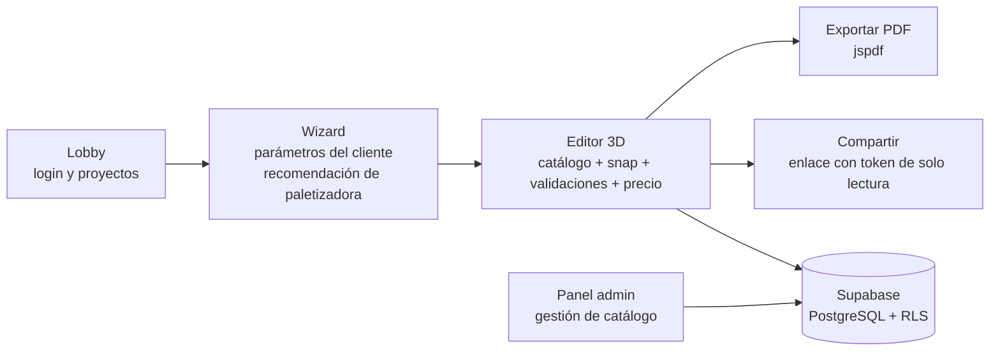

# Configurador 3D de Líneas de Paletizado — Verbruggen

Aplicación web (SPA) para **diseñar, validar y cotizar líneas de paletizado Verbruggen en 3D**. Un vendedor parte de los parámetros del cliente (producto, formato, capacidad), recibe una recomendación de paletizadora, arma la línea completa en un editor 3D con catálogo real de componentes, y obtiene el precio total. El proyecto se guarda en Supabase, puede compartirse con el cliente mediante un enlace de solo lectura y exportarse a PDF.

## Flujo de la aplicación



1. **Lobby**: inicio de sesión y listado de proyectos (favoritos, búsqueda, duplicado, borrado).
2. **Wizard**: captura de parámetros (producto, sacos/hora, tipo de palet, etc.) y recomendación automática del modelo de paletizadora.
3. **Editor 3D**: escena `react-three-fiber` con catálogo lateral, encaje por *snap points*, validaciones de compatibilidad y cálculo de precio en vivo. Soporta múltiples líneas por proyecto.
4. **Persistencia y salida**: guardado en Supabase, enlace de solo lectura por token y exportación de la propuesta a PDF.
5. **Panel admin**: alta/edición de componentes del catálogo (precios, specs, modelos 3D) para usuarios con rol `admin`.

## Stack

| Capa | Tecnología |
| --- | --- |
| UI | React 19 + TypeScript + Vite |
| Estado global | Zustand (`src/store/useConfiguratorStore.ts`) |
| 3D | three.js + @react-three/fiber + @react-three/drei (modelos `.glb` en `public/3d/`) |
| Base de datos | Supabase (PostgreSQL + Row Level Security) |
| PDF | jspdf |
| Tests | Vitest (mock de Supabase en memoria) |
| Deploy | Vercel (`npm run deploy` → `scripts/deploy.js`) |

## Estructura de carpetas

```
sales-configurator/
├── src/
│   ├── components/        # Lobby, Wizard, Viewport3D, ComponentSidebar,
│   │                      # ConfigPanel, TopBar, CatalogAdminPanel, ModelLoader...
│   ├── store/             # useConfiguratorStore.ts (Zustand: catálogo, líneas,
│   │                      # snap, precios, auth, share, guardado)
│   ├── lib/
│   │   ├── supabaseClient.ts        # Cliente real (lee VITE_SUPABASE_*)
│   │   └── __mocks__/supabaseClient.ts  # Mock en memoria para tests
│   └── __tests__/         # Suites de Vitest + setup.ts
├── public/3d/             # Modelos .glb (Git LFS)
├── supabase/migrations/   # Migraciones SQL — FUENTE DE VERDAD del esquema
├── database/              # Copia documental de esquema y seed (referencia)
├── scripts/deploy.js      # Despliegue a Vercel con VERCEL_TOKEN
├── docs/TESTING.md        # Guía de testing (estructura, mocks, cobertura)
├── DEVELOPMENT.md         # Flujo de trabajo, ramas, commits, CI
└── SECURITY.md            # Modelo de seguridad y gestión de incidentes
```

## Setup local

Requisitos: **Node.js >= 20** y npm.

```bash
# 1. Clonar e instalar dependencias
npm install

# 2. Configurar variables de entorno
#    Copia .env.example a .env y completa los valores reales
#    (Supabase Dashboard > Project Settings > API)
cp .env.example .env

# 3. Arrancar en desarrollo
npm run dev
```

Variables en `.env` (ver `.env.example`):

- `VITE_SUPABASE_URL` — URL del proyecto Supabase.
- `VITE_SUPABASE_ANON_KEY` — clave anónima (pública) de Supabase.
- `VERCEL_TOKEN` — solo necesario para `npm run deploy`.

> `.env` está en `.gitignore` y **nunca debe commitearse**. Ver [SECURITY.md](./SECURITY.md).

## Comandos

| Comando | Descripción |
| --- | --- |
| `npm run dev` | Servidor de desarrollo Vite con HMR |
| `npm run build` | `tsc -b` + build de producción en `dist/` |
| `npm run lint` | ESLint sobre todo el proyecto |
| `npm run test` | Suite completa de Vitest (una pasada) |
| `npm run test:watch` | Vitest en modo watch |
| `npm run preview` | Sirve el build de producción localmente |
| `npm run deploy` | Build + deploy a producción en Vercel (requiere `VERCEL_TOKEN`) |

## Base de datos y migraciones

La fuente de verdad del esquema es **`supabase/migrations/`** (formato del CLI de Supabase, con timestamp). La carpeta `database/` conserva una copia documental numerada del esquema y el seed para consulta.

Aplicar migraciones:

```bash
# Opción A: Supabase CLI (recomendada)
npx supabase link --project-ref TU-PROJECT-REF
npx supabase db push

# Opción B: SQL Editor del Dashboard de Supabase
# Ejecutar los archivos de supabase/migrations/ en orden cronológico
```

El seed del catálogo está incluido en las migraciones (`20260605000011_catalog_seed.sql`).

## Roles y seguridad (resumen)

- **Roles**: `admin` (CRUD de catálogo y todos los proyectos), `seller` (lectura de catálogo, CRUD de sus proyectos), `client` (solo lectura de proyectos compartidos).
- **RLS**: todas las tablas tienen Row Level Security activo; las políticas viven en las migraciones (`*_rls_policies.sql` y correcciones posteriores).
- **Compartir**: los proyectos se exponen a terceros únicamente mediante `share_token`, validado por políticas RLS en el servidor.

El detalle completo del modelo de seguridad, la rotación de credenciales y la respuesta al incidente del `.env` está en **[SECURITY.md](./SECURITY.md)**.

## Documentación relacionada

- [DEVELOPMENT.md](./DEVELOPMENT.md) — flujo de trabajo, estrategia de ramas, conventional commits, CI y checklist de PR.
- [SECURITY.md](./SECURITY.md) — modelo de seguridad, rotación de secretos y purga del historial.
- [docs/TESTING.md](./docs/TESTING.md) — infraestructura de tests, mocks y cobertura por niveles.
- [database/README.md](./database/README.md) — arquitectura del esquema (herencia de tablas de componentes).
